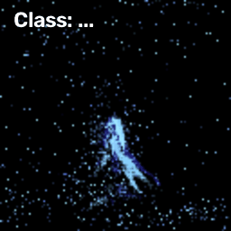

# snn-gesture-recognition-genx320

Welcome!

This repository includes the development stages and final release of a spiking neural network(SNN) model for event-based hand gesture recognition, using real-time data from a Prophesee GenX320 event camera, deployed on a Raspberry Pi. 

Event-based sensing and SNNs are both driven by change rather than fixed frames; a combination of them might be a step toward low-power, real-time gesture recognition on suitable hardware. The broader goal in this project was to explore how this kind of model can be trained and adapted across embedded hardware platforms with different constraints, and how accuracy and efficiency trade off as those constraints tighten. While the final model here is deployed on a Raspberry Pi, the same pipeline could serve as a starting point for deployment on more event-friendly / neuromorphic processors.

This project was done during my summer internship at the University of Twente, under the supervision of Assistant Professor Amir Yousefzadeh. Thanks for the guidance and support throughout this project.

## Repository Structure:

#### [REPORT.md](REPORT.md) :
- Report covering the project's progress: what is done and tested, decisions made, and full results

#### [release/](release/):
- The final model and code needed to run it.

#### [project-history/](project-history/):
- Code from each stage of the project, in the order it was developed.

#### [data/](data/)
- Details about the dataset used, including the fine-tuning data.

## Setup:

**Training / evaluation**: any machine with Python 3.11+.  
**Live deployment**: Raspberry Pi 5 + Prophesee GenX320 event camera.

**Software:**
- python==3.11
- torch==2.13.0
- spikingjelly==0.0.0.0.14
- numpy==1.26.4
- opencv-python==4.5.5.64
- Metavision SDK (Prophesee), needed only for camera access, install separately

## How to use:
- To run the final model, see the README in [release/](release/).
- For training, fine-tuning, or past experiments, see [project-history/](project-history/).
- For dataset details, see [data/](data/).

## Results summary:

- Fine-tuned model reaches **89.7%** accuracy on held-out test clips (92.1% excluding one ambiguous clip).
- Before fine-tuning, the base model (trained only on DVS128Gesture) scored **~16%** on GenX320 data. Fine-tuning was necessary, not just a marginal improvement.
- Inference latency: ~39ms/window (laptop CPU), ~370ms/window (Pi CPU), ~2.4ms/window (GPU). Real end-to-end latency on the Pi (live camera) is ~1.7s/prediction, since accumulating enough events takes longer than the inference itself.

See [REPORT.md](REPORT.md) for full results and analysis.

## Known Limitations:

- **Bias inconsistency across finetuning data**: camera bias settings weren't fully controlled between sessions; one session may have used a different setting by accident.
- **Held-out set is clip-held-out, not subject-held-out**: the 89.7% result shows generalization to new recordings of the same people, not to a new person.
- **Small dataset**: fine-tuning data is ~250 clips total, which limits how far the results generalize.

## Future Work:

- **Adapting and deploying the model on other hardware**
- **Enrich fine-tuning and testing data** — more clips, more subjects, more consistent recording conditions (see bias inconsistency above).

## Credits:
- [SpikingJelly](https://github.com/fangwei123456/spikingjelly): SNN framework used for training and inference. The training scripts are based on their `classify_dvsg.py` example, heavily modified (see `third-party-licenses/`).
- [DVS128Gesture](https://research.ibm.com/interactive/dvsgesture/): base training dataset.
- Portions of the code and documentation in this repository were developed with the assistance of Claude (Anthropic).
