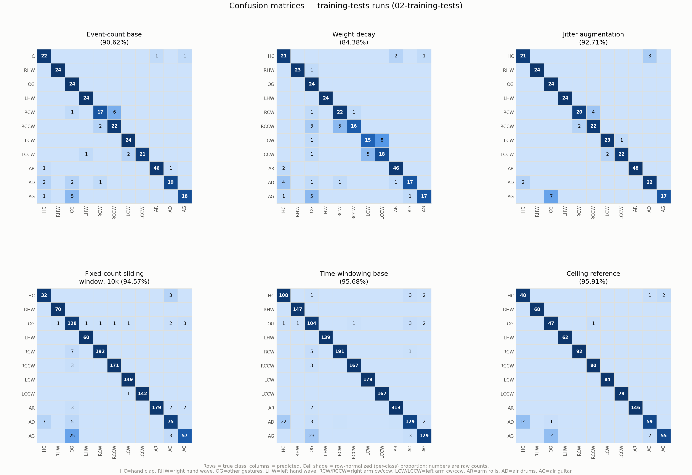
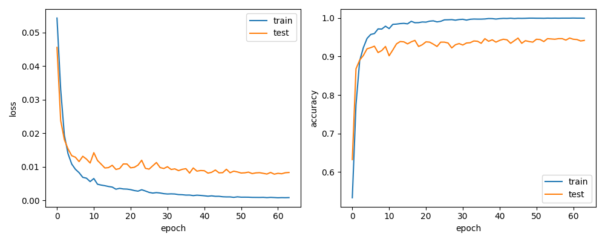

# snn-gesture-recognition-genx320 — Report

- [Overview](#overview)
- [Project Progression](#project-progression)
  - [1. Initial](#1-initial)
  - [2. Split by Time](#2-split-by-time)
  - [3. Ceiling Ref](#3-ceiling-ref)
  - [4. Event Count](#4-event-count)
  - [5. Recording](#5-recording)
  - [6. Event10k](#6-event10k)
  - [7. Finetuning](#7-finetuning)
  - [8. Latency](#8-latency)
  - [9. Environment Pi](#9-environment-pi)
  - [99. Accuracies / Domain Gap](#99-accuracies--domain-gap)
- [Key Findings / Results](#key-findings--results)
- [Limitations](#limitations)
- [Future Work](#future-work)
- [Notes](#notes)

## Overview

This project trains and deploys a spiking neural network (SNN) for event-based hand gesture recognition, using a Prophesee GenX320 event camera and a Raspberry Pi 5. 

The model is built with [SpikingJelly](https://github.com/fangwei123456/spikingjelly), base-trained on the DVS128Gesture dataset, then fine-tuned on custom recordings collected with the GenX320.

This report walks through the project chronologically, stage by stage (matching the folders in `project-history/`), then summarizes the key results, known limitations, and open directions for future work.

## Project Progression
### Preparation

Before building a model, getting familiar with the framework and setting up the environment was crucial. The first stage of the project consisted of a literature review on SNNs and event-based data processing, followed by setting up the Raspberry Pi–Prophesee GenX320 connection via the Metavision SDK and preparing a virtual environment. The Raspberry Pi used was a Raspberry Pi 5 Model B, running Python 3.11.2 and was set up using Prophesee's custom Linux image (based on Raspberry Pi OS Bookworm), which comes with the RPi sensor driver and OpenEB precompiled. SpikingJelly was chosen as the SNN framework, with PyTorch (2.13.0) and NumPy (1.26.4) installed at the versions recommended by SpikingJelly's documentation. OpenCV (4.5.5.64) was added for monitoring/visualization.

### 1. Initial Model ([01-test-model](project-history/01-test-model))
This is a tiny model along with the first working end-to-end pipeline, meant to establish training, evaluation, and live inference before scaling up to the actual training. 

#### Training
SpikingJelly's DVSGestureNet on DVS128Gesture was trained with reduced settings to keep it fast: 32 channels, 8 timesteps, batch size 2, 2 epochs. An event-count based windowing approach was preferred for robustness between DVS128 (used for base training) and GenX320 (the actual deployment camera), since fixed-time windows would capture very different numbers of events on each sensor. 

#### Evaluation
For this initial model two evaluation approaches were used: first a static evaluation against ready-made frames from the DVS128Gesture test set, and later a streaming evaluation that replays raw events through the same count-based windowing used for live inference. Only the streaming evaluation was used for the following stages.

**Static evaluation** (full DVS128Gesture test set): 63.5% overall accuracy (183/288). Some classes did well (right hand wave 100%, left hand wave 96%), others poorly (right arm clockwise 8%, air drums 33%), which is expected for a 2-epoch test run.

**Streaming (count-based windowing) evaluation** reproduced the exact same accuracy and confusion matrix as the static evaluation (183/288, identical per-cell), confirming the streaming windowing matches the offline run exactly. It also showed that frame construction (the event-to-frame loop) took ~704ms on average, far more than the ~145ms net inference, a sign that event-accumulation, not compute, would be the real-time bottleneck later in the project.

#### Live Inference Pipeline
A live inference pipeline was built to run on the Raspberry Pi: collecting event data from the GenX320 sensor, binning it into frames, and using the trained model weights to classify gestures.

The first version (`pipeline_basic.py`) was a bare-minimum loop: open the camera, accumulate events into count-based frames, run inference, print the predicted class. This version performed poorly for a couple of reasons. The center-crop technique it used was flawed — discarding everything outside a fixed 128×128 window of the sensor's 320×320 output. The event-count mismatch between sensors was also huge: EVENTS_PER_FRAME was first set to 11,000, based on an average from DVS128 training clips, but on the GenX320 sensor that barely supplied any information, causing the model to collapse to predicting a single class.

`pipeline_final.py` was built as an improved version. Event count was raised to 30,000, which performed noticeably better, at least producing varied predictions, even though accuracy remained low as expected. Center-crop was abandoned in favor of downscaling the full sensor frame instead. Diagnostics such as occ (occupancy, the fraction of pixels with any events), tot (average total events per frame), and per-window timing, along with a live cv2 visualization showing predicted class names, were also added.
Camera bias was also introduced as a controllable variable, but the value initially used (-80) was later found to fail on this hardware, silently falling back to a prevailing default bias instead. The value was later fixed at 25/28, not because it improved accuracy, but because that happened to be the setting accidentally used to record some of the training clips, so keeping it kept the live pipeline consistent with the data.

In summary, this stage established the full pipeline end-to-end — training, evaluation, and live inference — and surfaced the core problem that would shape the rest of the project: DVS128 and GenX320 differ enormously in event density, so windowing choices tuned for one sensor don't transfer to the other. Resolving that mismatch became the focus of the following stages.

### 2. Training Experiments ([02-training-tests](project-history/02-training-tests))

Building on the initial model from stage 1, this stage tests different windowing strategies and training variations before deciding on a model to carry forward. The tests include two windowing approaches: event-count-based (frames built from a fixed or per-recording-adaptive number of events) and time-based (frames built from fixed real-time durations). Event-count windowing was also tested with variations to compare accuracy.

#### [Event-count base](project-history/02-training-tests/01-eventcount-base)
This run continues directly from the initial model in stage 1, using the same event-count windowing (split_by='number') but scaling up the settings: 64 channels, T=8, batch size 16, 64 epochs.   
It reached 90.62% accuracy (261/288) on the DVS128Gesture test set. Right arm clockwise was the weakest class (70.83%), mostly mistaken for its counter-clockwise counterpart. Air drums and air guitar were also weak, and air guitar was most often confused with "other gestures". This left room for improvement, so a few variations were explored next to see if accuracy could be pushed higher.

#### [Weight decay](project-history/02-training-tests/02-eventcount-with-decaying-weight)
Same base config, but with weight decay (1e-4) added to the optimizer, a small penalty that shrinks the weights slightly on every step, to see if it would help avoid overfitting.  
It didn't. Accuracy dropped to 84.38% (243/288), worse across most classes than the base run. Weight decay was dropped from later runs.

#### [Jitter augmentation](project-history/02-training-tests/03-eventcount-jitter)
Same base config, with a random per-sample pixel shift (±4px, same shift applied across all T frames) added as augmentation.  
Accuracy rose to 92.71% (267/288), which was an improvement from previous runs, but still short of satisfying. 

#### [Split by time](project-history/02-training-tests/05-time-windowing)
Looking for a higher accuracy, a different windowing strategy was tried next: splitting each recording into fixed 125ms time windows instead of counting events. Same base config otherwise — 64 channels, T=8, batch size 16, 64 epochs, no augmentation or weight decay.  
It reached 95.68% accuracy (1,773/1,853 windows), the best result of any run so far on DVS128Gesture. Air drums (81.65%) and air guitar (83.23%) remained the weakest classes.

Despite the higher accuracy here, this approach performed poorly once tested on the live inference pipeline with real GenX320 data, likely due to the large density mismatch between the two sensors.

#### [Fixed-count sliding window (10k)](project-history/02-training-tests/04-eventcount-sliding-10k)
Event-count windowing was revisited as a solution to the density mismatch. As expected, it did better than time-windowed on live deployment, but that still was not enough to resolve the density mismatch issue.  

The problem stemmed from something more fundamental: SpikingJelly's split_by='number' divided each recording into frames based on that recording's own total event count, so frame density still varied recording to recording during training, while live prediction always read a fixed absolute number of events per frame. To better match training with live inference, a new approach was tested: building frames from a fixed count of events instead during training, the same mechanism the live GenX320 pipeline uses.  

This approach required deciding on a fixed event count before training. Measuring events-per-frame per gesture class showed density varies about 3.8x across classes (right arm counter-clockwise highest, hand clap lowest). 10,000 events was chosen because it was close to the lowest classes' 10th-percentile density, keeping every class represented even after the fixed cutoff, at the cost of hand clap losing more samples than the rest.
Below is a full breakdown of events-per-frame density per class.

  
| class | mean | p10 | p25 | median | p75 | p90 | min | max | n_frames |
|---|---|---|---|---|---|---|---|---|---|
| hand clap | 19542 | 8499 | 10865 | 15256 | 22960 | 33758 | 6329 | 70930 | 776 |
| right hand wave | 33059 | 12763 | 21753 | 31664 | 39344 | 51938 | 5122 | 95414 | 784 |
| left hand wave | 51182 | 10102 | 25494 | 42364 | 67627 | 115182 | 4408 | 146724 | 784 |
| right arm clockwise | 31356 | 11568 | 19663 | 26003 | 42837 | 59234 | 6631 | 80655 | 784 |
| right arm counter clockwise | 74642 | 38702 | 49202 | 71954 | 95622 | 121329 | 13558 | 176462 | 784 |
| left arm clockwise | 62951 | 32305 | 40357 | 58481 | 81826 | 97353 | 13714 | 199324 | 784 |
| left arm counter clockwise | 58269 | 29244 | 36774 | 52270 | 75585 | 96904 | 10538 | 168107 | 784 |
| arm roll | 52015 | 26540 | 34962 | 48659 | 69033 | 83544 | 11947 | 132300 | 792 |
| air drums | 44843 | 22648 | 29818 | 44594 | 57472 | 68433 | 8764 | 109591 | 1568 |
| air guitar | 42654 | 20089 | 30840 | 37657 | 49439 | 70678 | 10600 | 148042 | 784 |
| other gestures | 27671 | 12432 | 18019 | 25522 | 34673 | 51431 | 5515 | 65588 | 784 |

This approach reached 94.57% accuracy (1,255/1,327 windows) on the test dataset, the best of the event-count runs. It is worth noting this approach supplied more windows per clip, possibly inflating the accuracy. Still, it's a solid number, and more importantly, its windowing already matched how the live pipeline builds frames, for a better match with deployment overall.  

Two things are worth noting here: hand clap didn't improve along with the rest of the classes in this run (91.43%, essentially unchanged from the base run's 91.67%, while most other classes climbed to 96-100%), consistent with it losing the most samples to the fixed-count cutoff as the lowest-density class. Air guitar remained the weakest class (67.06%), still most often confused with "other gestures", a recurring pattern across every method tried. Air drums and hand clap followed (85.23% and 91.43%), confused with each other in this run, likely because they are both low-density, similarly positioned gestures.

#### [Ceiling reference](project-history/02-training-tests/06-ceiling-ref)
By this point, event-count windowing looked like the strongest candidate for actual deployment. Still, one more run was made to check how much accuracy could be pushed. The best DVS128Gesture performer so far, time-windowing, was scaled up (128 channels, T=16) as a ceiling reference.  
It reached 95.91% accuracy (820/855 windows), barely above split-by-time's 95.68%, despite 2.3x the parameters and roughly 4.5x the inference time. So it wasn't really improved.

#### Final Decision

Across all six runs, the fixed-count event-count windowing (10k) was the one carried forward: not the highest DVS128Gesture accuracy of the group, but the only approach whose windowing matched how the live GenX320 pipeline builds frames. Confusion matrices for all six runs are shown below.

Training curves for the selected model are also shown below. Test accuracy sits around 92-95% while train accuracy approaches 100%, showing some overfitting.

Full details and training curves for every run are available in [project-history](project-history/02-training-tests).

### 3. Finetuning (03-finetuning](project-history/03-finetuning))

The model so far has never seen real GenX320 data, only DVS128Gesture, which causes a mismatch between training and deployment. This stage records real GenX320 gesture data and fine-tunes the model on it directly.

#### Recording the dataset
Gesture clips were recorded live from the GenX320 sensor. Sensor was placed at a desk height, and subjects performed the gestures in a seated position, around 1.5 meters away from the camera. Two subjects (A and B) were recorded initially, each providing around 10-15 usable clips per class. Subjects C and D were added later as additional recordings from A and B respectively.

The dataset can be found in [genx320-data-for-finetuning](/data/genx320-data-for-finetuning).

#### Analysis of the finetuning set [recording-analysis](project-history/03-finetuning/recording-analysis)
An earlier check on GenX320 data had only looked at events per frame, not events per second. Ideally, frames from training and fine-tuning would span similar durations of motion. With a density gap this large, that was not fully achievable, but getting close was the goal. 

Real-time event density was computed per class for both DVS128Gesture and GenX320. The per-class rankings matched closely between the two, confirming the density differences come from the gestures themselves rather than the sensor. However, absolute density was 5-10x higher on GenX320 than on DVS128Gesture.

| class | DVS p10 | DVS median | DVS p90 | GenX p10 | GenX median | GenX p90 | median ratio |
|---|---|---|---|---|---|---|---|
| hand clap | 13,919 | 25,199 | 49,128 | 166,772 | 198,177 | 288,961 | 7.9x |
| right hand wave | 18,614 | 39,911 | 62,184 | 172,198 | 238,324 | 389,434 | 6.0x |
| other gestures | 32,380 | 79,843 | 148,770 | 227,054 | 450,353 | 629,603 | 5.6x |
| left hand wave | 14,593 | 35,422 | 64,996 | 189,386 | 255,141 | 389,651 | 7.2x |
| right arm clockwise | 43,026 | 72,235 | 107,198 | 342,753 | 455,421 | 561,051 | 6.3x |
| right arm counter clockwise | 43,202 | 74,020 | 121,742 | 301,826 | 413,235 | 596,851 | 5.6x |
| left arm clockwise | 34,904 | 55,839 | 107,824 | 325,463 | 412,337 | 526,156 | 7.4x |
| left arm counter clockwise | 35,304 | 57,609 | 103,871 | 305,291 | 423,016 | 475,121 | 7.3x |
| arm rolls | 30,984 | 48,362 | 79,693 | 302,311 | 414,034 | 581,034 | 8.6x |
| air drums | 29,463 | 45,227 | 85,565 | 283,171 | 354,089 | 490,693 | 7.8x |
| air guitar | 19,059 | 33,559 | 62,740 | 212,449 | 296,323 | 416,548 | 8.8x |

#### Testing Deduplication of Events Approach
As the event-densities showed,  using the same N_EVENTS = 10000 value on GenX320 would span too little real time per frame, frames would no longer represent a consistent motion. 

For this reason, an approach of deduplicating events, merging spatially neighboring events and repeat firings from the same pixel close in time,  was tested as a way to shrink GenX320's event count without losing real temporal coverage. Temporal-only dedup (refractory suppression on repeat firings at native 320x320 resolution) reduced it by 11.6%; combined, the two together reduced it by 29.0%.

Even combined, a 29% reduction fell far short of closing the density gap, dedup alone wasn't the fix. Still, a small held-out test set was set aside to directly compare a deduped fine-tuning run against a raw one, in case dedup helped in ways the density numbers alone didn't capture.

#### Choosing N_EVENTS for Finetuning
Picking N_EVENTS was an important task, since in an event-count based approach it's the number that determines what a frame captures. Initial goal was to keep motion duration per frame would stay consistent between training and fine-tuning, but that turned out infeasible: the density gap was too large, matching duration exactly would mean frames with far more raw events than the model was ever trained on, closer to training from scratch than fine-tuning. On top of that, the fine-tuning clips were recorded without this constraint in mind, and some didn't contain enough events to form all T frames.

This left a tradeoff to find a sweet spot for: frame duration. 

Based on the density gap and usable windows, two candidates were chosen: 37k and 50k. Below is their duraiton table:

| class | DVS p25 | DVS med | DVS p75 | 37k p25 | 37k med | 37k p75 | 50k p25 | 50k med | 50k p75 |
|---|---|---|---|---|---|---|---|---|---|
| hand clap | 0.260 | 0.360 | 0.508 | 0.110 | 0.155 | 0.185 | 0.151 | 0.212 | 0.257 |
| right hand wave | 0.146 | 0.205 | 0.287 | 0.118 | 0.161 | 0.191 | 0.165 | 0.220 | 0.270 |
| other gestures | 0.089 | 0.134 | 0.203 | 0.071 | 0.091 | 0.110 | 0.100 | 0.126 | 0.149 |
| left hand wave | 0.146 | 0.220 | 0.289 | 0.104 | 0.147 | 0.180 | 0.155 | 0.189 | 0.238 |
| right arm clockwise | 0.098 | 0.130 | 0.177 | 0.065 | 0.077 | 0.092 | 0.088 | 0.103 | 0.123 |
| right arm counter clockwise | 0.084 | 0.132 | 0.162 | 0.076 | 0.093 | 0.103 | 0.100 | 0.123 | 0.138 |
| left arm clockwise | 0.113 | 0.144 | 0.205 | 0.075 | 0.085 | 0.101 | 0.101 | 0.118 | 0.143 |
| left arm counter clockwise | 0.119 | 0.155 | 0.215 | 0.069 | 0.088 | 0.107 | 0.093 | 0.126 | 0.148 |
| arm rolls | 0.138 | 0.182 | 0.226 | 0.075 | 0.087 | 0.105 | 0.100 | 0.113 | 0.143 |
| air drums | 0.142 | 0.190 | 0.242 | 0.091 | 0.114 | 0.120 | 0.124 | 0.149 | 0.163 |
| air guitar | 0.180 | 0.243 | 0.324 | 0.095 | 0.129 | 0.150 | 0.140 | 0.171 | 0.201 |

Neither candidate was close to matching DVS128's frame duration, that's the tradeoff described above. Re-recording clips to be longer was considered, but it was a fair amount of work. 50k was chosen because it was higher, with a manageable number of clips needing to be re-recorded.

#### Bias Inconsistency Problem
While re-recording, a HAL error was noticed: setting the bias values to -80/-80 failed, since that was outside the sensor's valid range. This probably affected the earlier recording sessions as well. At the time of re-recording, bias read back as 25/28, but the value used for subjects A and B is unknown. 25/28 was set for recordings going forward, as that is the one value confirmed to have actually been used while recording.

A paired comparison found new-batch recordings ran 1.5-2.0x higher density than old-batch recordings, a real but not large effect. And since count-based windowing is inherently built to absorb this kind of variation, the density difference was considered small enough, and the project proceeded without re-recording.

While re-recording, the recorder threw a HAL error failing to set the bias values to -80/-80 (the setting used for the original A/B recordings). A bias readback added after the .set() calls showed the camera consistently falling back to +25/+28 whenever -80 failed -- reproducible across sessions, and confirmed by Prophesee's bias documentation to be outside the sensor's valid range for GenX320-class devices.

This meant subjects recorded before and after this point could be at different bias states -- and subject B's session may have additionally run an earlier +20-bias script first, adding a third possible state. A paired comparison (same real subject, old batch vs re-recorded batch: A vs C, B vs D) found new-batch recordings ran 1.5-2.0x higher density than old-batch recordings across nearly every comparable class.

The effect was real but not large -- similar in scale to the subject-style variance already found in the density analysis -- and count-based windowing is inherently density-agnostic by design, built specifically to absorb this kind of variation. Given time constraints, the dataset was not fully re-recorded to fix this; it is documented here as a known limitation rather than resolved.

### 5. Recording ([5-Recording](project-history/5-Recording))

### 8. Latency ([8-Latency](project-history/8-Latency))

### 9. Environment Pi ([9-EnvironmentPi](project-history/9-EnvironmentPi))

### 99. Accuracies / Domain Gap ([99-Accuracies_DomainGap](project-history/99-Accuracies_DomainGap))

## Key Findings / Results

## Limitations

## Future Work

## Notes

